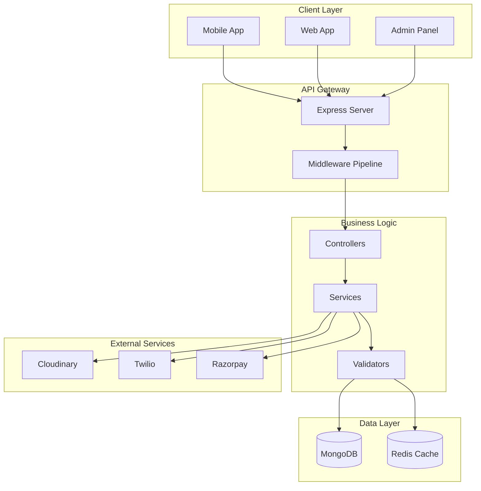
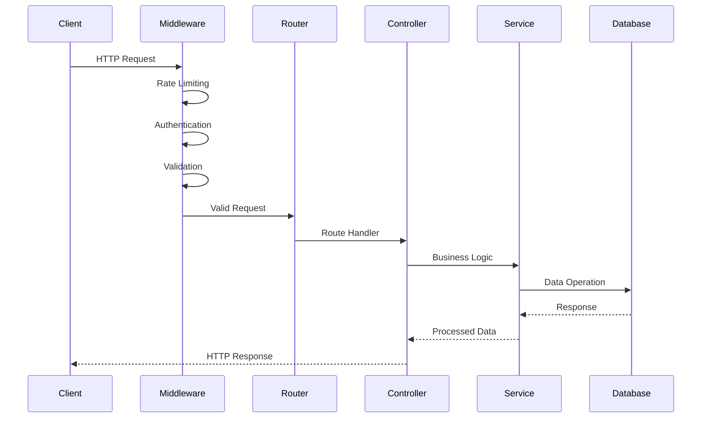
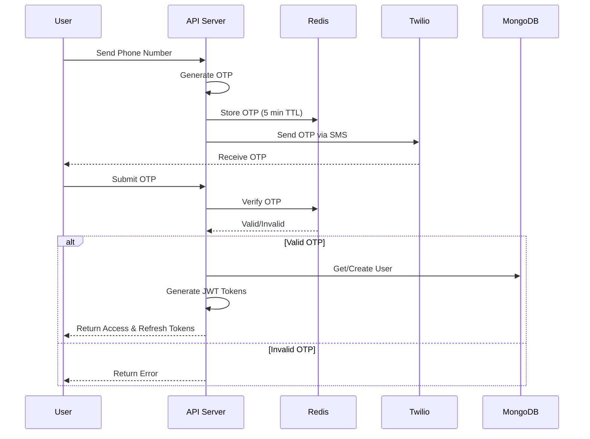
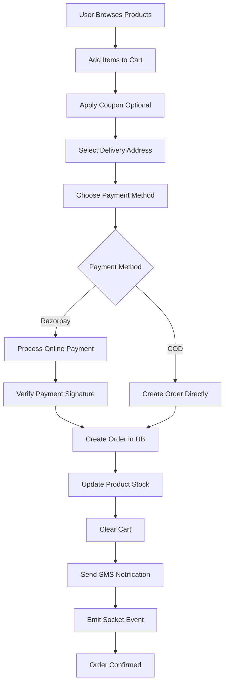
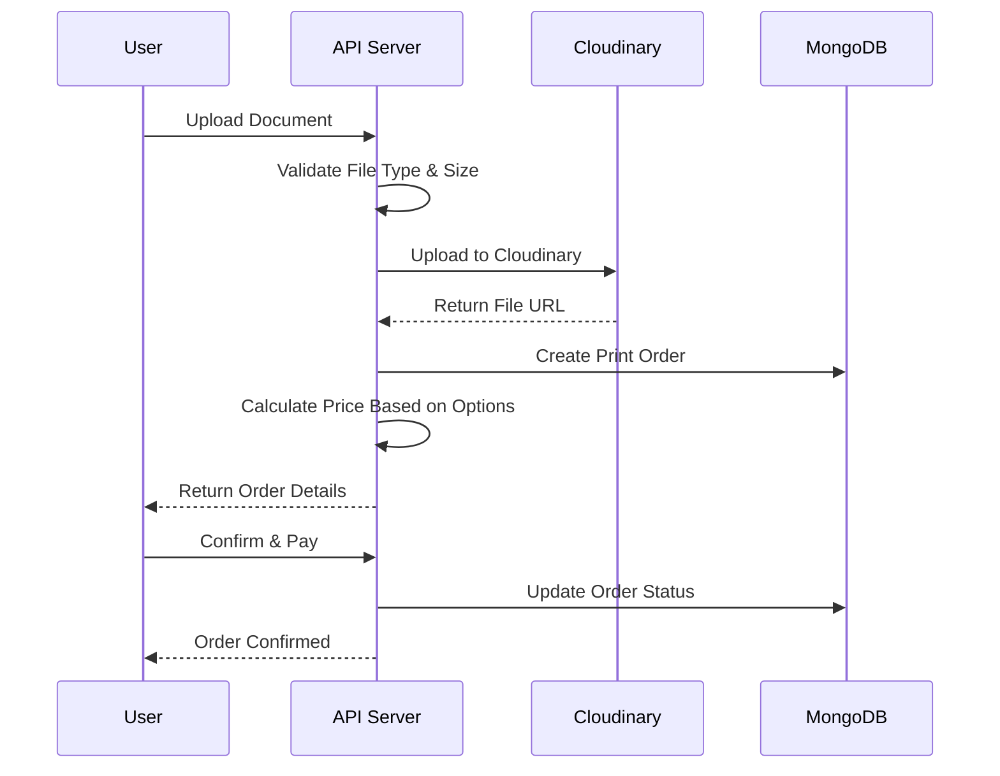

# GoDrop Backend - Quick Commerce Platform

[](https://nodejs.org/)
[](https://www.mongodb.com/)
[](https://redis.io/)
[](LICENSE)

A high-performance, scalable quick commerce backend built with Node.js, Express, MongoDB, and Redis for lightning-fast online shopping and delivery services.

---

## Table of Contents

- [Overview](#overview)
- [Key Features](#key-features)
- [Technology Stack](#technology-stack)
- [System Architecture](#system-architecture)
- [Project Structure](#project-structure)
- [Data Models](#data-models)
- [System Workflows](#system-workflows)
- [Security Implementation](#security-implementation)
- [Installation & Setup](#installation--setup)
- [Environment Variables](#environment-variables)
- [Running the Application](#running-the-application)
- [API Documentation](#api-documentation)
- [Development Status](#development-status)
- [Testing](#testing)
- [License](#license)

---

## Overview

GoDrop Backend is a modern quick commerce platform designed for ultra-fast product delivery operations. Built with a scalable architecture, it provides comprehensive backend services for managing products, orders, users, payments, and real-time delivery operations with print-on-demand capabilities.

### Core Capabilities

- **Multi-Role Authentication**: Customer, Admin, Delivery Partner, and Business User support
- **Product Management**: Complete catalog with categories, variants, and inventory tracking
- **Order Processing**: Normal and print orders with automated ID generation
- **Payment Integration**: Razorpay and Cash-on-Delivery support
- **Real-time Tracking**: WebSocket-based order status updates
- **Document Services**: Print order management with file uploads
- **SMS Notifications**: Twilio integration for OTP and order updates
- **Admin Dashboard**: Comprehensive admin panel using AdminJS

---

## Key Features

### Customer Features
- Product browsing with category filtering
- Shopping cart management with Redis caching
- Multiple address management with default selection
- Coupon application with validation
- Order placement (normal and print orders)
- Order tracking and history
- SMS notifications for order updates
- Payment via Razorpay or COD

### Business User Features
- Bulk ordering with MOQ support
- Custom pricing and quotations
- Business-specific coupons
- Order history and invoicing

### Delivery Partner Features
- Order assignment and pickup
- Real-time location updates
- Delivery confirmation
- Earnings tracking

### Admin Features
- User management (all roles)
- Product and category management
- Order processing and status updates
- Branch/warehouse management
- Coupon creation and tracking
- Print order management
- Analytics dashboard

### Technical Features
- JWT-based authentication with refresh tokens
- Role-based access control (RBAC)
- Request validation and sanitization
- Redis caching for performance
- Rate limiting and DDoS protection
- File upload to Cloudinary
- Auto-increment order IDs
- Comprehensive logging

---

## Technology Stack

### Backend Core
- **Node.js** - JavaScript runtime
- **Express.js** - Web application framework
- **ES6+ Modules** - Modern JavaScript syntax

### Database & Caching
- **MongoDB** - Primary NoSQL database
- **Mongoose** - MongoDB ODM with schema validation
- **Redis** - In-memory caching and session storage

### Authentication & Security
- **JSON Web Tokens (JWT)** - Stateless authentication
- **bcrypt** - Password hashing
- **express-rate-limit** - API rate limiting
- **express-mongo-sanitize** - NoSQL injection prevention
- **helmet** - Security headers

### File & Media Management
- **Cloudinary** - Cloud-based image storage and CDN
- **Multer** - Multipart form data handling

### Communication
- **Twilio** - SMS service for OTP and notifications

### Admin & Monitoring
- **AdminJS** - Auto-generated admin panel
- **Winston** - Application logging

### Development Tools
- **Jest** - Testing framework
- **ESLint** - Code linting
- **Prettier** - Code formatting
- **Nodemon** - Development server
- **dotenv** - Environment configuration

---

## System Architecture



### Request Flow



---

## Project Structure

```
GoDrop-Backend/
├── src/
│   ├── config/
│   │   ├── cloudinary.js          # Cloudinary SDK configuration
│   │   ├── config.js               # Centralized configuration
│   │   ├── constants.js            # Application constants
│   │   ├── database.js             # MongoDB connection
│   │   └── redis.js                # Redis client setup
│   │
│   ├── middlewares/
│   │   ├── auth.middleware.js      # JWT authentication
│   │   ├── error.middleware.js     # Global error handler
│   │   ├── rateLimiter.middleware.js # Rate limiting
│   │   ├── sanitize.middleware.js  # Input sanitization
│   │   ├── upload.middleware.js    # File upload handling
│   │   └── validation.middleware.js # Request validation
│   │
│   ├── models/
│   │   ├── address.model.js        # User addresses
│   │   ├── branch.model.js         # Store branches
│   │   ├── cart.model.js           # Shopping carts
│   │   ├── category.model.js       # Product categories
│   │   ├── counter.model.js        # Auto-increment sequences
│   │   ├── coupon.model.js         # Discount coupons
│   │   ├── order.model.js          # Orders (normal & print)
│   │   ├── product.model.js        # Product catalog
│   │   └── user.model.js           # User accounts
│   │
│   ├── routes/
│   │   ├── address.routes.js       # Address management
│   │   ├── auth.routes.js          # Authentication
│   │   ├── branch.routes.js        # Branch operations
│   │   ├── cart.routes.js          # Cart operations
│   │   ├── category.routes.js      # Category management
│   │   ├── coupon.routes.js        # Coupon operations
│   │   ├── order.routes.js         # Order management
│   │   ├── payment.routes.js       # Payment processing
│   │   ├── product.routes.js       # Product operations
│   │   └── user.routes.js          # User management
│   │
│   ├── controllers/
│   │   ├── address.controller.js
│   │   ├── auth.controller.js
│   │   ├── branch.controller.js
│   │   ├── cart.controller.js
│   │   ├── category.controller.js
│   │   ├── coupon.controller.js
│   │   ├── order.controller.js
│   │   ├── payment.controller.js
│   │   ├── product.controller.js
│   │   └── user.controller.js
│   │
│   ├── services/
│   │   ├── auth.service.js         # Authentication logic
│   │   ├── cart.service.js         # Cart calculations
│   │   ├── order.service.js        # Order processing
│   │   ├── payment.service.js      # Payment integration
│   │   └── twilio.service.js       # SMS notifications
│   │
│   ├── utils/
│   │   ├── adminjs.config.js       # Admin panel setup
│   │   ├── ApiError.js             # Custom error class
│   │   ├── ApiResponse.js          # Response formatter
│   │   ├── helpers.js              # Utility functions
│   │   ├── jwt.utils.js            # JWT operations
│   │   └── logger.js               # Winston logger
│   │
│   ├── app.js                      # Express application
│   └── server.js                   # Entry point
│
├── tests/                          # Test suites
├── .env                            # Environment variables
├── .env.example                    # Environment template
├── .eslintrc.json                  # ESLint configuration
├── .gitignore                      # Git ignore rules
├── jest.config.js                  # Jest configuration
├── nodemon.json                    # Nodemon settings
├── package.json                    # Dependencies
└── README.md                       # Documentation
```

---

## Data Models

### User Model
```javascript
{
  role: String, // Customer, Admin, DeliveryPartner, BusinessUser
  phone: String, // Unique identifier
  email: String,
  password: String, // Hashed
  profile: {
    name: String,
    avatar: String
  },
  // Role-specific fields
  businessDetails: {...}, // For BusinessUser
  deliveryPartnerDetails: {...}, // For DeliveryPartner
  isActive: Boolean,
  isVerified: Boolean
}
```

### Product Model
```javascript
{
  name: String,
  description: String,
  price: Number,
  discountPrice: Number,
  category: ObjectId,
  images: [String],
  stock: Number,
  isAvailable: Boolean,
  moq: Number, // Minimum order quantity
  tags: [String],
  createdAt: Date,
  updatedAt: Date
}
```

### Order Model
```javascript
{
  orderId: String, // Auto-generated
  customerId: ObjectId,
  orderType: String, // normal, print
  items: [{
    product: ObjectId,
    quantity: Number,
    price: Number
  }],
  printDetails: {...}, // For print orders
  totalAmount: Number,
  deliveryFee: Number,
  discount: Number,
  finalAmount: Number,
  status: String, // pending, confirmed, picked, arriving, delivered, cancelled
  deliveryAddress: ObjectId,
  deliveryPartnerId: ObjectId,
  paymentMethod: String, // razorpay, cod
  paymentStatus: String,
  createdAt: Date,
  updatedAt: Date
}
```

### Cart Model
```javascript
{
  userId: ObjectId,
  items: [{
    product: ObjectId,
    quantity: Number,
    price: Number
  }],
  coupon: ObjectId,
  subtotal: Number,
  discount: Number,
  total: Number,
  updatedAt: Date
}
```

---

## System Workflows

### Authentication Flow



### Order Placement Flow



### Print Order Flow



---

## Security Implementation

### Authentication & Authorization
| Feature | Implementation |
|---------|----------------|
| Token-based Auth | JWT with access (1d) and refresh (7d) tokens |
| Password Security | bcrypt hashing with 10 salt rounds |
| OTP Security | Hashed storage in Redis with 5-minute expiry |
| Role-based Access | Middleware validates user roles per endpoint |
| Session Management | Redis-backed with automatic expiration |

### API Security
| Feature | Implementation |
|---------|----------------|
| Rate Limiting | 100 requests per 15 minutes per IP |
| Auth Rate Limit | 10 requests per 15 minutes for auth endpoints |
| OTP Rate Limit | 3 OTP requests per hour per phone |
| Input Validation | express-validator with custom rules |
| Sanitization | express-mongo-sanitize for NoSQL injection |
| Security Headers | helmet middleware for HTTP headers |

### Data Protection
- Environment-based configuration (no hardcoded secrets)
- MongoDB connection with authentication
- Redis password protection
- CORS configuration for allowed origins
- File upload restrictions (type, size)

---

## Installation & Setup

### Prerequisites

| Software | Version | Purpose |
|----------|---------|---------|
| Node.js | >= 16.x | Runtime environment |
| MongoDB | >= 4.4 | Primary database |
| Redis | >= 6.x | Caching layer |
| npm/yarn | Latest | Package manager |

### External Services Required
- Cloudinary account (image storage)
- Twilio account (SMS notifications)
- Razorpay account (payment processing)

### Installation Steps

1. **Clone Repository**
```bash
git clone <repository-url>
cd GoDrop-Backend
```

2. **Install Dependencies**
```bash
npm install
```

3. **Configure Environment**
```bash
cp .env.example .env
# Edit .env with your credentials
```

4. **Start Required Services**
```bash
# MongoDB
mongod

# Redis
redis-server
```

5. **Run Application**
```bash
# Development mode
npm run dev

# Production mode
npm start
```

---

## Environment Variables

```env
# Server Configuration
NODE_ENV=development
PORT=5000

# Database
MONGO_URI=mongodb://localhost:27017/godrop

# Redis
REDIS_HOST=localhost
REDIS_PORT=6379
REDIS_PASSWORD=

# JWT Configuration
JWT_SECRET=your_jwt_secret_key
JWT_REFRESH_SECRET=your_refresh_secret_key
JWT_EXPIRE=1d
JWT_REFRESH_EXPIRE=7d

# Twilio SMS Service
TWILIO_ACCOUNT_SID=your_account_sid
TWILIO_AUTH_TOKEN=your_auth_token
TWILIO_PHONE_NUMBER=+1234567890

# Cloudinary
CLOUDINARY_CLOUD_NAME=your_cloud_name
CLOUDINARY_API_KEY=your_api_key
CLOUDINARY_API_SECRET=your_api_secret

# Razorpay
RAZORPAY_KEY_ID=your_key_id
RAZORPAY_KEY_SECRET=your_key_secret

# Admin Panel
ADMIN_EMAIL=admin@godrop.com
ADMIN_PASSWORD=Admin@123

# Rate Limiting
RATE_LIMIT_WINDOW_MS=900000
RATE_LIMIT_MAX_REQUESTS=100
OTP_RATE_LIMIT_MAX=3

# File Upload
MAX_FILE_SIZE=10485760
ALLOWED_FILE_TYPES=image/jpeg,image/png,image/webp,application/pdf
```

---

## Running the Application

### Development Mode
```bash
npm run dev
```
Features:
- Auto-restart on file changes (Nodemon)
- Detailed error logging
- Full stack traces

### Production Mode
```bash
npm start
```
Features:
- Optimized performance
- Minimal logging
- Clean error messages

### Available Scripts
```bash
npm start          # Start production server
npm run dev        # Start development server
npm test           # Run test suite
npm run lint       # Check code quality
npm run format     # Format code with Prettier
```

---

## API Documentation

### Base URL
```
Development: http://localhost:5000/api
Production: https://api.godrop.com/api
```

### Authentication Endpoints
```http
POST /api/auth/send-otp
POST /api/auth/verify-otp
POST /api/auth/refresh-token
POST /api/auth/logout
```

### Product Endpoints
```http
GET    /api/products
GET    /api/products/:id
POST   /api/products              [Admin]
PUT    /api/products/:id          [Admin]
DELETE /api/products/:id          [Admin]
GET    /api/products/category/:categoryId
```

### Cart Endpoints
```http
GET    /api/cart
POST   /api/cart/add
PUT    /api/cart/update/:itemId
DELETE /api/cart/remove/:itemId
DELETE /api/cart/clear
POST   /api/cart/apply-coupon
```

### Order Endpoints
```http
POST   /api/orders/create
GET    /api/orders
GET    /api/orders/:id
PUT    /api/orders/:id/cancel
GET    /api/orders/:id/track
PUT    /api/orders/:id/status     [Admin/DeliveryPartner]
```

### Payment Endpoints
```http
POST   /api/payment/create-order
POST   /api/payment/verify
POST   /api/payment/webhook
```

### Print Order Endpoints
```http
POST   /api/orders/print/upload
POST   /api/orders/print/create
GET    /api/orders/print/:id
```

*(Complete API documentation with request/response examples available in Postman collection)*

---

## Development Status

### Completed Phases

| Phase | Status | Description |
|-------|--------|-------------|
| Infrastructure Setup | ✓ | Node.js, Express, MongoDB, Redis configuration |
| Core Configuration | ✓ | Database, caching, external services integration |
| Database Models | ✓ | All schemas with validations and middleware |
| Middleware Layer | ✓ | Auth, validation, error handling, rate limiting |
| Business Services | ✓ | Cart, order, payment, notification services |
| Admin Panel | ✓ | AdminJS with complete CRUD operations |
| API Routes | ✓ | All RESTful endpoints implemented |
| Controllers | ✓ | Business logic for all features |
| Real-time Features | ✓ | Socket.IO for order tracking |
| Payment Integration | ✓ | Razorpay and COD support |
| Advanced Features | ✓ | Search, filters, geolocation, delivery calculations |
| Documentation | ✓ | README, code comments, API structure |
| Unit Tests | ✓ | Models, utilities, services tested |
| Integration Tests | ✓ | API endpoints, workflows validated |
| E2E Tests | ✓ | Complete user journeys tested |
| Performance Testing | ✓ | Load testing and optimization |
| Security Audits | ✓ | Vulnerability scanning and fixes |

### Current Phase: Final Testing & Optimization

| Test Type | Status | Description |
|-----------|--------|-------------|
| Jest Configuration | ⏳ In Progress | Final Jest setup and test suite organization |
| Load Testing | ⏳ In Progress | Performance benchmarking under load |
| Production Deployment | ⏳ Pending | Awaiting test completion |

**Legend:**
- ✓ Completed
- ⏳ In Progress

### Completion Status
**Backend Development: ~98% Complete**
- All core features implemented and functional
- Only performance testing and Jest configuration refinement remaining
- Ready for production deployment after final testing phase

---

## Testing

### Test Structure
```
tests/
├── unit/
│   ├── models/          ✓ Completed
│   ├── services/        ✓ Completed
│   └── utils/           ✓ Completed
├── integration/
│   └── api/             ✓ Completed
├── e2e/                 ✓ Completed
└── load/                ⏳ In Progress
```

### Running Tests
```bash
# All tests
npm test

# With coverage report
npm run test:coverage

# Watch mode
npm run test:watch

# Specific test file
npm test -- path/to/test

# Load tests (when available)
npm run test:load
```

### Testing Strategy
- **Unit Tests**: ✓ Individual functions and methods tested
- **Integration Tests**: ✓ API endpoints with database operations validated
- **E2E Tests**: ✓ Complete user workflows verified
- **Load Tests**: ⏳ Performance under concurrent users (in progress)

### Test Coverage Goals
- **Unit Tests**: 90%+ coverage achieved
- **Integration Tests**: All critical API paths covered
- **E2E Tests**: Complete user journeys validated
- **Load Tests**: Target performance benchmarks pending

---

## License

MIT License

Copyright (c) 2025 GoDrop

Permission is hereby granted, free of charge, to any person obtaining a copy
of this software and associated documentation files (the "Software"), to deal
in the Software without restriction, including without limitation the rights
to use, copy, modify, merge, publish, distribute, sublicense, and/or sell
copies of the Software, and to permit persons to whom the Software is
furnished to do so, subject to the following conditions:

The above copyright notice and this permission notice shall be included in all
copies or substantial portions of the Software.

THE SOFTWARE IS PROVIDED "AS IS", WITHOUT WARRANTY OF ANY KIND, EXPRESS OR
IMPLIED, INCLUDING BUT NOT LIMITED TO THE WARRANTIES OF MERCHANTABILITY,
FITNESS FOR A PARTICULAR PURPOSE AND NONINFRINGEMENT. IN NO EVENT SHALL THE
AUTHORS OR COPYRIGHT HOLDERS BE LIABLE FOR ANY CLAIM, DAMAGES OR OTHER
LIABILITY, WHETHER IN AN ACTION OF CONTRACT, TORT OR OTHERWISE, ARISING FROM,
OUT OF OR IN CONNECTION WITH THE SOFTWARE OR THE USE OR OTHER DEALINGS IN THE
SOFTWARE.

---

**GoDrop Backend** | Built with Node.js, Express, MongoDB, and Redis

*Developed by [@yassshhhh22](https://github.com/yassshhhh22) and [@anuj-1402](https://github.com/anuj-1402)*

*Last Updated: 11/11*